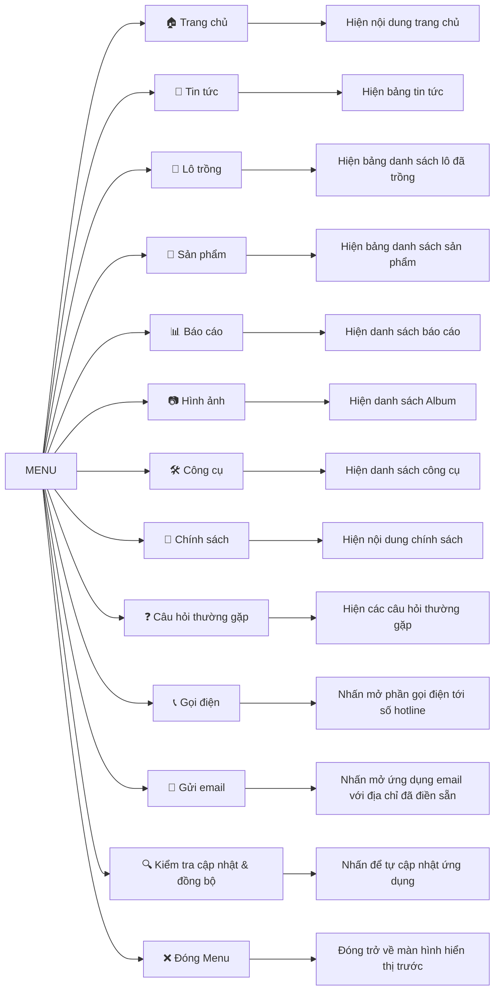

```mermaid
flowchart LR
MENU --> HOME["🏠 Trang chủ"] --> HOME-CONTENT["Hiện nội dung trang chủ"]

MENU --> NEWS["📰 Tin tức"] --> NEWS-TABLE["Hiện bảng tin tức"]

MENU --> BATCHES["🎋 Lô trồng"] --> BATCHES-TABLE["Hiện bảng danh sách lô đã trồng"]

MENU --> PRODUCTS["🛒 Sản phẩm"] -->   PRODUCTS-TABLE["Hiện bảng danh sách sản phẩm"]

MENU --> REPORT["📊 Báo cáo"] --> REPORT-LIST["Hiện danh sách báo cáo"]

MENU --> PHOTOS["📷 Hình ảnh"] --> PHOTOS-ALBUM-LIST["Hiện danh sách Album"]

MENU --> TOOLS["🛠 Công cụ"] --> TOOLS-LIST["Hiện danh sách công cụ"]

MENU --> POLICY["📖 Chính sách"] --> POLICY-CONTENT["Hiện nội dung chính sách"]

MENU --> FAQ["❓ Câu hỏi thường gặp"] --> FAQ-CONTENT["Hiện các câu hỏi thường gặp"]

MENU --> HOTLINE["📞 Gọi điện"] --> HOTLINE-CALL-LINK["Nhấn mở phần gọi điện tới số hotline"]

MENU --> EMAIL["📧 Gửi email"] --> EMAIL-APP-OPEN-LINK["Nhấn mở ứng dụng email với địa chỉ đã điền sẵn"]

MENU --> UPDATE["🔍 Kiểm tra cập nhật & đồng bộ"] --> UPDATE-MANUAL["Nhấn để tự cập nhật ứng dụng"]

MENU --> CLOSE["❌ Đóng Menu"] --> DISPLAY-PRE-CONTENT["Đóng trở về màn hình hiển thị trước"]

```
