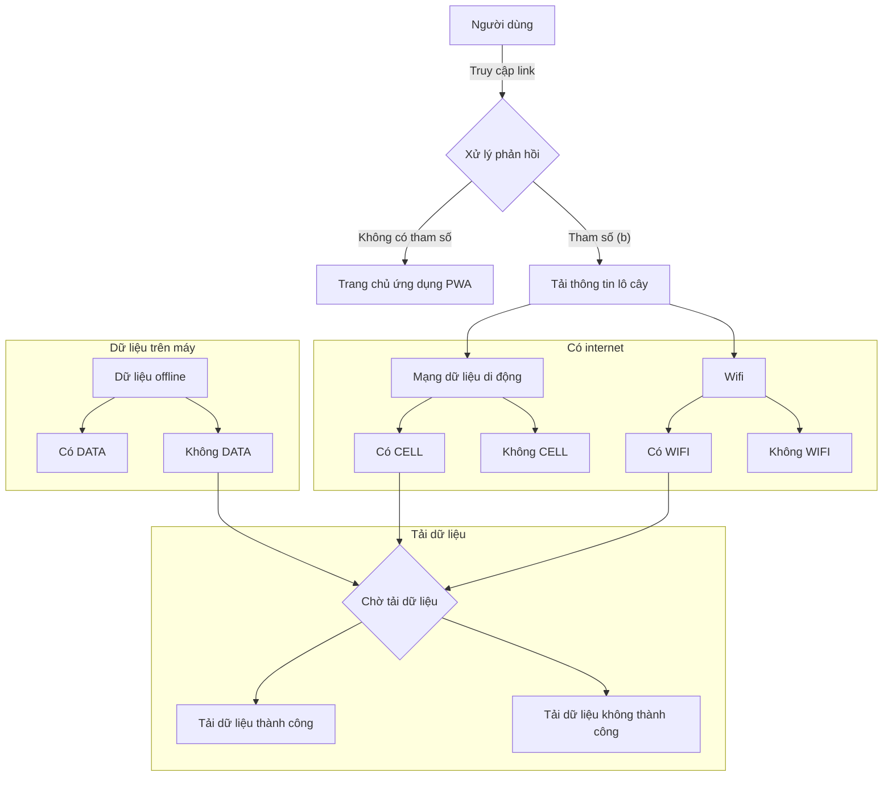

```mermaid
flowchart TD

USER["Người dùng"] --> |"Truy cập link"| REDIRECT{Xử lý phản hồi}

REDIRECT -->|"Không có tham số"| APP-HOME["Trang chủ ứng dụng PWA"]

REDIRECT -->|"Tham số (b)"| BATCH-FETCH["Tải thông tin lô cây"]

BATCH-FETCH --> CELL
BATCH-FETCH --> WIFI

subgraph INTERNET["Có internet"]
CELL["Mạng dữ liệu di động"]
    CELL --> CELL-Y["Có CELL"]
    CELL --> CELL-N["Không CELL"]
WIFI["Wifi"]
    WIFI --> WIFI-Y["Có WIFI"]
    WIFI --> WIFI-N["Không WIFI"]
end

subgraph LOCAL["Dữ liệu trên máy"]
DATA["Dữ liệu offline"]
    DATA --> DATA-Y["Có DATA"]
    DATA --> DATA-N["Không DATA"]
end

subgraph FETCH["Tải dữ liệu"]
WAIT{"Chờ tải dữ liệu"}
    WIFI-Y --> WAIT
    CELL-Y --> WAIT
    DATA-N --> WAIT

    WAIT --> FETCH-Y["Tải dữ liệu thành công"]
    WAIT --> FETCH-N["Tải dữ liệu không thành công"]


end
```
