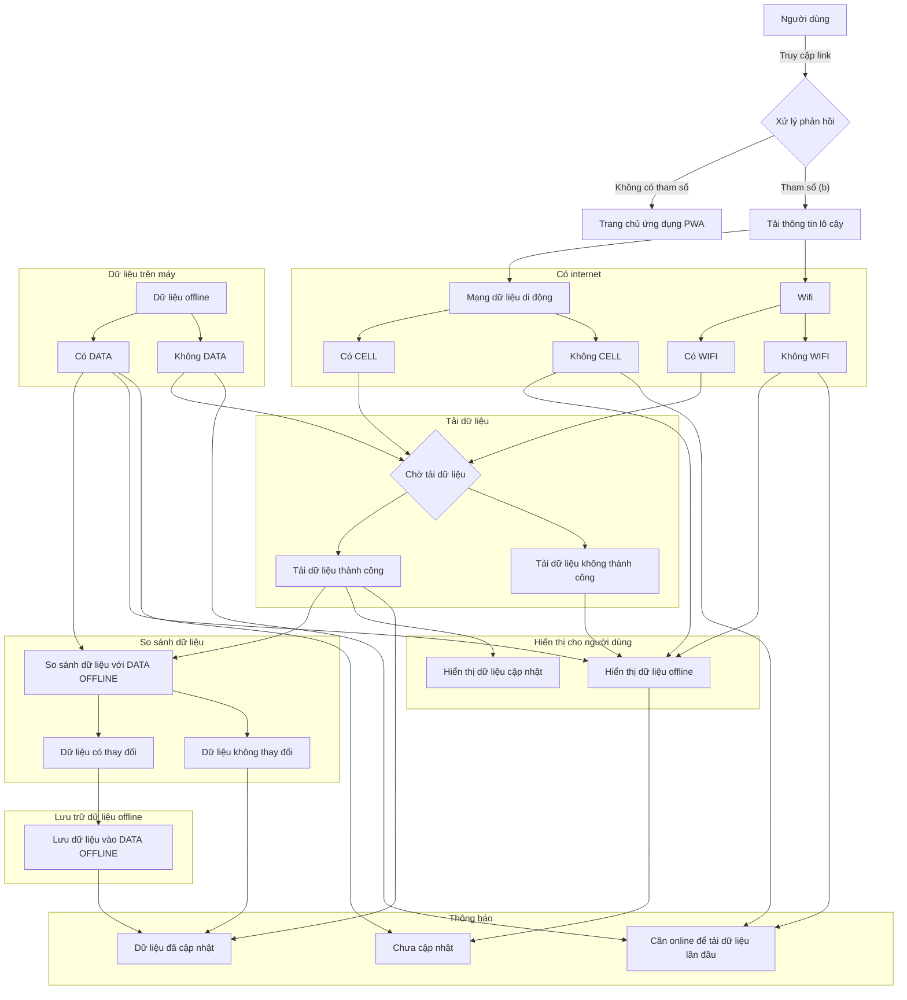

```mermaid
flowchart TD

USER["Người dùng"] --> |"Truy cập link"| REDIRECT{Xử lý phản hồi}

REDIRECT -->|"Không có tham số"| APP-HOME["Trang chủ ứng dụng PWA"]

REDIRECT -->|"Tham số (b)"| BATCH-FETCH["Tải thông tin lô cây"]

BATCH-FETCH --> CELL
BATCH-FETCH --> WIFI

subgraph INTERNET["Có internet"]
CELL["Mạng dữ liệu di động"]
    CELL --> CELL-Y["Có CELL"]
    CELL --> CELL-N["Không CELL"]
WIFI["Wifi"]
    WIFI --> WIFI-Y["Có WIFI"]
    WIFI --> WIFI-N["Không WIFI"]
end

subgraph LOCAL["Dữ liệu trên máy"]
DATA["Dữ liệu offline"]
    DATA --> DATA-Y["Có DATA"]
    DATA --> DATA-N["Không DATA"]
end

subgraph FETCH["Tải dữ liệu"]
WAIT{"Chờ tải dữ liệu"}
    WIFI-Y --> WAIT
    CELL-Y --> WAIT
    DATA-N --> WAIT

    WAIT --> FETCH-Y["Tải dữ liệu thành công"]
    WAIT --> FETCH-N["Tải dữ liệu không thành công"]
end

subgraph COMPARE-MANAGER["So sánh dữ liệu"]
COMPARE["So sánh dữ liệu với DATA OFFLINE"]
    DATA-Y --> COMPARE
    FETCH-Y --> COMPARE

    COMPARE --> COMPARE-Y["Dữ liệu có thay đổi"]
    COMPARE --> COMPARE-N["Dữ liệu không thay đổi"]
end

subgraph SAVE-MANAGER["Lưu trữ dữ liệu offline"]
SAVE["Lưu dữ liệu vào DATA OFFLINE"]
    COMPARE-Y --> SAVE
end

subgraph DISPLAY["Hiển thị cho người dùng"]
ONLINE["Hiển thị dữ liệu cập nhật"]
    FETCH-Y --> ONLINE

OFFLINE["Hiển thị dữ liệu offline"]
    WIFI-N --> OFFLINE
    CELL-N --> OFFLINE
    DATA-Y --> OFFLINE
    FETCH-N --> OFFLINE
end

subgraph NOTIFICATION["Thông báo"]
EMPTY["Cần online để tải dữ liệu lần đầu"]
    WIFI-N --> EMPTY
    CELL-N --> EMPTY
    DATA-N --> EMPTY

SUCCESS["Dữ liệu đã cập nhật"]
    FETCH-Y --> SUCCESS
    SAVE --> SUCCESS
    COMPARE-N --> SUCCESS

FAIL["Chưa cập nhật"]
    DATA-Y --> FAIL
    OFFLINE --> FAIL
end
```
