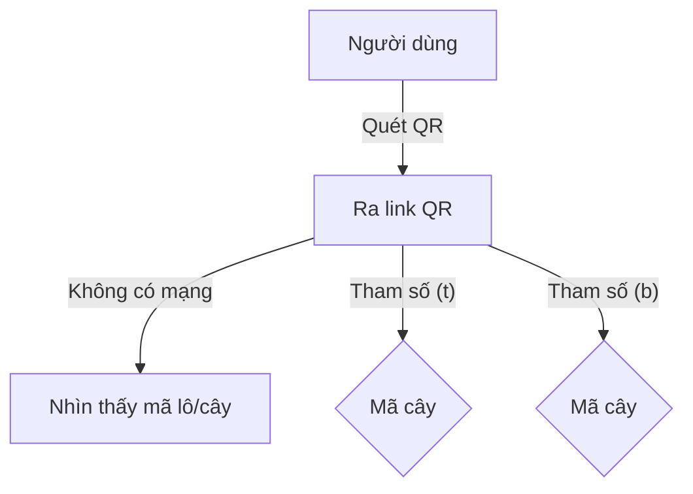

```mermaid
flowchart TD
USER["Người dùng"] --> |"Quét QR"| QR-LINK["Ra link QR"] --> |"Không có mạng"| DISPLAY["Nhìn thấy mã lô/cây"]

QR-LINK -->|"Tham số (t)"| TREE-CODE{Mã cây}
QR-LINK -->|"Tham số (b)"| BRANCH-CODE{Mã cây}
```
