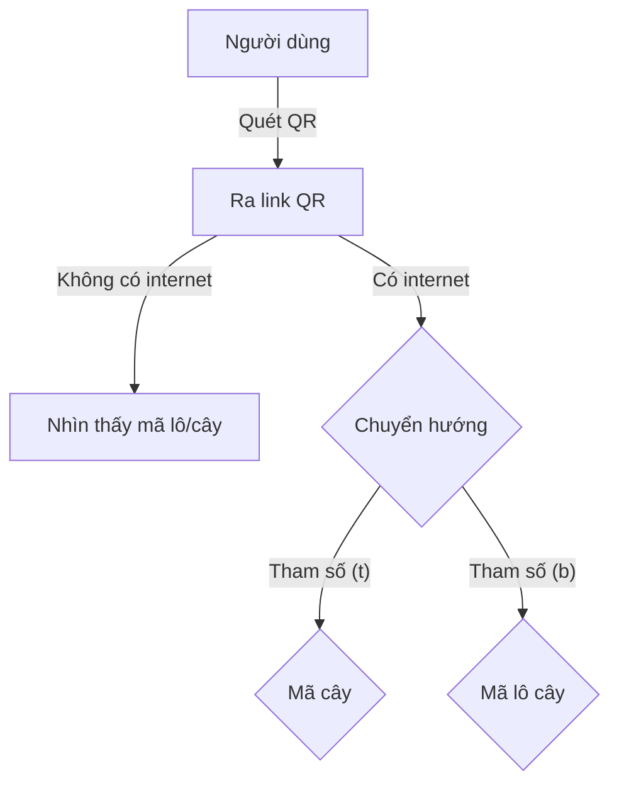

```mermaid
flowchart TD
USER["Người dùng"] --> |"Quét QR"| QR-LINK["Ra link QR"] --> |"Không có internet"| DISPLAY["Nhìn thấy mã lô/cây"]
QR-LINK -->|"Có internet"| REDIRECT{"Chuyển hướng"}
REDIRECT -->|"Tham số (t)"| TREE-CODE{Mã cây}
REDIRECT -->|"Tham số (b)"| BRANCH-CODE{Mã lô cây}
```
