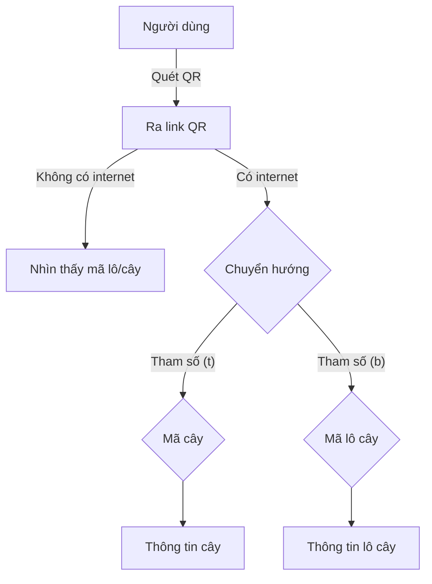

```mermaid
flowchart TD
USER["Người dùng"] --> |"Quét QR"| QR-LINK["Ra link QR"] --> |"Không có internet"| DISPLAY["Nhìn thấy mã lô/cây"]
QR-LINK -->|"Có internet"| REDIRECT{"Chuyển hướng"}

REDIRECT -->|"Tham số (t)"| TREE-CODE{Mã cây}

REDIRECT -->|"Tham số (b)"| BATCH-CODE{Mã lô cây}

TREE-CODE --> TREE-INFO["Thông tin cây"]

BATCH-CODE --> BATCH-INFO["Thông tin lô cây"]

```
