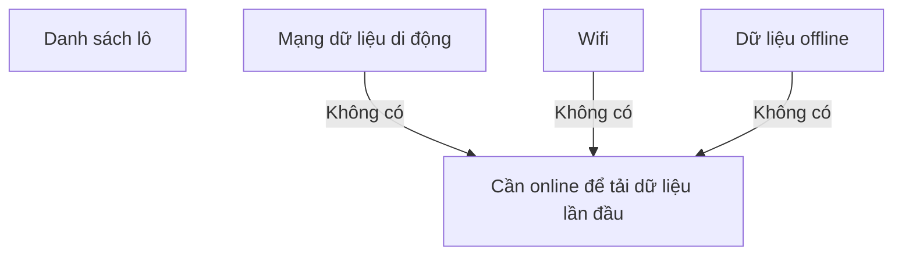

```mermaid
flowchart TD
A["Danh sách lô"]
B["Mạng dữ liệu di động"]
C["Wifi"]
D["Dữ liệu offline"]

E["Cần online để tải dữ liệu lần đầu"]

B --> |"Không có"| E
C --> |"Không có"| E
D --> |"Không có"| E

```
