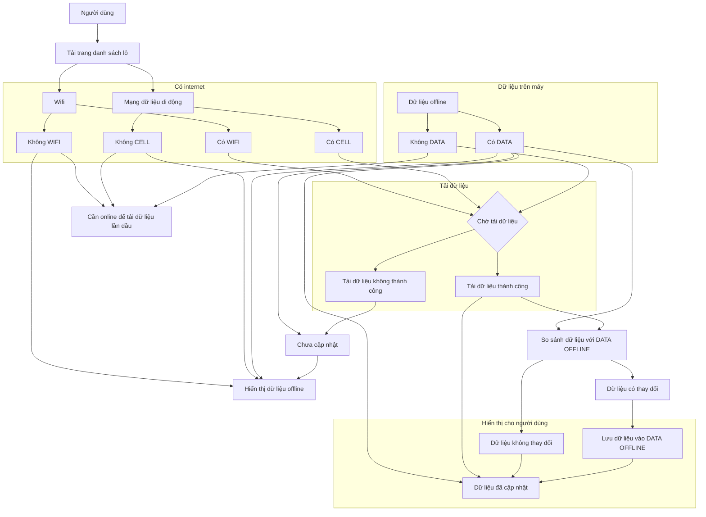

```mermaid
flowchart TD
USER["Người dùng"]
LOAD["Tải trang danh sách lô"]


USER --> LOAD
LOAD --> WIFI
LOAD --> CELL


subgraph INTERNET["Có internet"]
CELL["Mạng dữ liệu di động"]
    CELL --> CELL-Y["Có CELL"]
    CELL --> CELL-N["Không CELL"]
WIFI["Wifi"]
    WIFI --> WIFI-Y["Có WIFI"]
    WIFI --> WIFI-N["Không WIFI"]
end

subgraph LOCAL["Dữ liệu trên máy"]
DATA["Dữ liệu offline"]
    DATA --> DATA-Y["Có DATA"]
    DATA --> DATA-N["Không DATA"]
end


EMPTY["Cần online để tải dữ liệu lần đầu"]

WIFI-N --> EMPTY
CELL-N --> EMPTY
DATA-N --> EMPTY


OFFLINE["Hiển thị dữ liệu offline"]

WIFI-N --> OFFLINE
CELL-N --> OFFLINE
DATA-Y --> OFFLINE


subgraph FETCH["Tải dữ liệu"]
WAIT{"Chờ tải dữ liệu"}
    WIFI-Y --> WAIT
    CELL-Y --> WAIT
    DATA-N --> WAIT

    WAIT --> FETCH-Y["Tải dữ liệu thành công"]
    WAIT --> FETCH-N["Tải dữ liệu không thành công"]
end


FAIL["Chưa cập nhật"]
DATA-Y --> FAIL
FETCH-N --> FAIL
FAIL --> OFFLINE

COMPARE["So sánh dữ liệu với DATA OFFLINE"]

DATA-Y --> COMPARE
FETCH-Y --> COMPARE

COMPARE --> COMPARE-Y["Dữ liệu có thay đổi"]
COMPARE --> COMPARE-N["Dữ liệu không thay đổi"]


SAVE["Lưu dữ liệu vào DATA OFFLINE"]

COMPARE-Y --> SAVE


subgraph DISPLAY["Hiển thị cho người dùng"]
SUCCESS["Dữ liệu đã cập nhật"]
    DATA-Y --> SUCCESS
    FETCH-Y --> SUCCESS
    COMPARE-N --> SUCCESS
    SAVE --> SUCCESS
end
```
