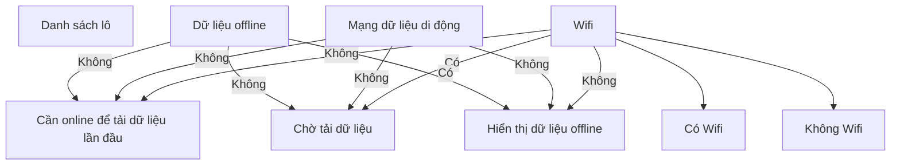

```mermaid
flowchart TD
A["Danh sách lô"]
CELL["Mạng dữ liệu di động"]
WIFI["Wifi"]
DATA["Dữ liệu offline"]


WIFI --> WIFI-Y["Có Wifi"]
WIFI --> WIFI-N["Không Wifi"]

E["Cần online để tải dữ liệu lần đầu"]

WIFI --> |"Không"| E
CELL --> |"Không"| E
DATA --> |"Không"| E

WAIT["Chờ tải dữ liệu"]

WIFI --> |"Có"| WAIT
CELL --> |"Không"| WAIT
DATA --> |"Không"| WAIT


OFFLINE["Hiển thị dữ liệu offline"]

WIFI --> |"Không"| OFFLINE
CELL --> |"Không"| OFFLINE
DATA --> |"Có"| OFFLINE


```
