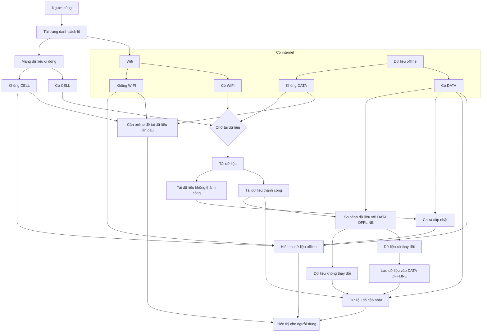

```mermaid
flowchart TD
USER["Người dùng"]
LOAD["Tải trang danh sách lô"]


USER --> LOAD
LOAD --> WIFI
LOAD --> CELL


CELL["Mạng dữ liệu di động"]

CELL --> CELL-Y["Có CELL"]
CELL --> CELL-N["Không CELL"]


subgraph INTERNET["Có internet"]

WIFI["Wifi"]
    WIFI --> WIFI-Y["Có WIFI"]
    WIFI --> WIFI-N["Không WIFI"]

DATA["Dữ liệu offline"]
    DATA --> DATA-Y["Có DATA"]
    DATA --> DATA-N["Không DATA"]
end


EMPTY["Cần online để tải dữ liệu lần đầu"]

WIFI-N --> EMPTY
CELL-N --> EMPTY
DATA-N --> EMPTY

WAIT{"Chờ tải dữ liệu"}

WIFI-Y --> WAIT
CELL-Y --> WAIT
DATA-N --> WAIT


OFFLINE["Hiển thị dữ liệu offline"]

WIFI-N --> OFFLINE
CELL-N --> OFFLINE
DATA-Y --> OFFLINE

FETCH["Tải dữ liệu"]

WAIT --> FETCH


FETCH-Y["Tải dữ liệu thành công"]
FETCH-N["Tải dữ liệu không thành công"]

FETCH --> FETCH-Y
FETCH --> FETCH-N

SUCCESS["Dữ liệu đã cập nhật"]

DATA-Y --> SUCCESS
FETCH-Y --> SUCCESS

FAIL["Chưa cập nhật"]
DATA-Y --> FAIL
FETCH-N --> FAIL
FAIL --> OFFLINE

COMPARE["So sánh dữ liệu với DATA OFFLINE"]

DATA-Y --> COMPARE
FETCH-Y --> COMPARE

COMPARE --> COMPARE-Y["Dữ liệu có thay đổi"]
COMPARE --> COMPARE-N["Dữ liệu không thay đổi"]

COMPARE-N --> SUCCESS

SAVE["Lưu dữ liệu vào DATA OFFLINE"]

COMPARE-Y --> SAVE
SAVE --> SUCCESS


DISPLAY("Hiển thị cho người dùng")

SUCCESS --> DISPLAY
OFFLINE --> DISPLAY
EMPTY --> DISPLAY
```
