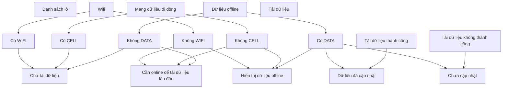

```mermaid
flowchart TD
A["Danh sách lô"]
CELL["Mạng dữ liệu di động"]

CELL --> CELL-Y["Có CELL"]
CELL --> CELL-N["Không CELL"]

WIFI["Wifi"]

WIFI --> WIFI-Y["Có WIFI"]
WIFI --> WIFI-N["Không WIFI"]

DATA["Dữ liệu offline"]

DATA --> DATA-Y["Có DATA"]
DATA --> DATA-N["Không DATA"]


EMPTY["Cần online để tải dữ liệu lần đầu"]

WIFI-N --> EMPTY
CELL-N --> EMPTY
DATA-N --> EMPTY

WAIT["Chờ tải dữ liệu"]

WIFI-Y --> WAIT
CELL-Y --> WAIT
DATA-N --> WAIT


OFFLINE["Hiển thị dữ liệu offline"]

WIFI-N --> OFFLINE
CELL-N --> OFFLINE
DATA-Y --> OFFLINE

FETCH["Tải dữ liệu"]
FETCH-Y["Tải dữ liệu thành công"]
FETCH-N["Tải dữ liệu không thành công"]

SUCCESS["Dữ liệu đã cập nhật"]

DATA-Y --> SUCCESS
FETCH-Y --> SUCCESS

FAIL["Chưa cập nhật"]
DATA-Y --> FAIL
FETCH-N --> FAIL
```
