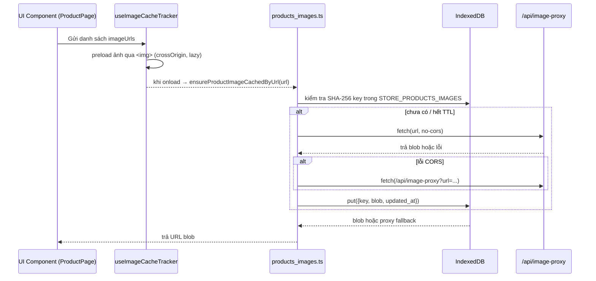

```mermaid
sequenceDiagram
  participant UI as UI Component (ProductPage)
  participant Hook as useImageCacheTracker
  participant Lib as products_images.ts
  participant DB as IndexedDB
  participant Proxy as /api/image-proxy

  UI->>Hook: Gửi danh sách imageUrls
  Hook->>Hook: preload ảnh qua <img> (crossOrigin, lazy)
  Hook-->>Lib: khi onload → ensureProductImageCachedByUrl(url)
  Lib->>DB: kiểm tra SHA-256 key trong STORE_PRODUCTS_IMAGES
  alt chưa có / hết TTL
    Lib->>Proxy: fetch(url, no-cors)
    Proxy-->>Lib: trả blob hoặc lỗi
    alt lỗi CORS
      Lib->>Proxy: fetch(/api/image-proxy?url=...)
    end
    Lib->>DB: put({key, blob, updated_at})
  end
  DB-->>Lib: blob hoặc proxy fallback
  Lib-->>UI: trả URL blob
```
