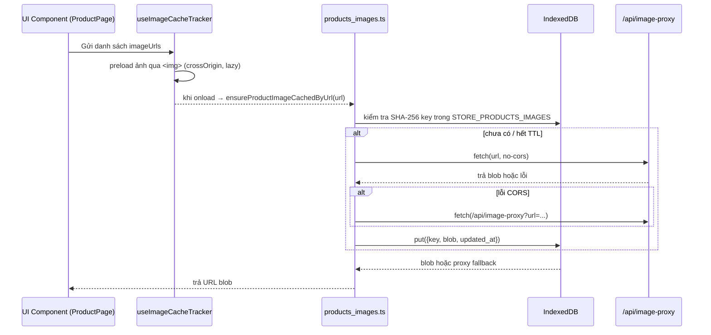

```mermaid
flowchart TD

A[Component / Page] -->|danh sách URL ảnh| B[useImageCacheTracker hook]
B -->|"prefetch + kiểm tra lỗi"| C{"Loại ảnh?"}

C -->|news| D["ensureNewsImageCachedByUrl()"]
C -->|product| E["ensureProductImageCachedByUrl()"]
C -->|generic| F["fetch trực tiếp, không lưu IDB"]

D -->|"goi"| G[saveNewsImageByUrl()]
E -->|"goi"| H[saveProductImageIfNotExists()]

G -->|"dung"| I[fetchImageBlobSmart()]
H -->|"dung"| J[tryFetchImage()]

I -->|"lấy ảnh"| K1[fetch trực tiếp] -->|nếu lỗi| K2[/api/image-proxy/]
J -->|"lấy ảnh"| L1[fetch no-cors] -->|nếu lỗi| L2[/api/image-proxy/]

K2 & L2 --> M[Edge Function image-proxy]
M -->|"tải & cache CDN"| N[(Ảnh đích gốc hoặc remote server)]

I & J --> O[Blob data]
O -->|put| P[(IndexedDB store)]
P -->|"sau đó"| Q[Render UI bằng URL.createObjectURL(blob)]

```
