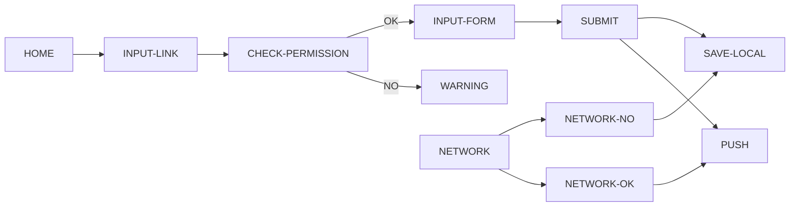

```mermaid
flowchart LR
HOME --> INPUT-LINK --> CHECK-PERMISSION;

CHECK-PERMISSION --> |OK| INPUT-FORM;

CHECK-PERMISSION --> |NO| WARNING;

INPUT-FORM --> SUBMIT;

NETWORK --> NETWORK-NO;

NETWORK --> NETWORK-OK;

SUBMIT --> SAVE-LOCAL;

NETWORK-NO --> SAVE-LOCAL;

NETWORK-OK --> PUSH
SUBMIT --> PUSH

```
