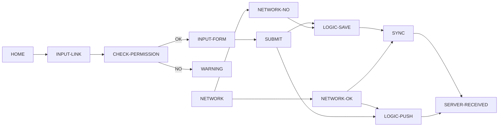

```mermaid
flowchart LR
HOME --> INPUT-LINK --> CHECK-PERMISSION;

CHECK-PERMISSION --> |OK| INPUT-FORM;

CHECK-PERMISSION --> |NO| WARNING;

INPUT-FORM --> SUBMIT;

NETWORK --> NETWORK-NO;

NETWORK --> NETWORK-OK;

SUBMIT --> LOGIC-SAVE;

NETWORK-NO --> LOGIC-SAVE;

NETWORK-OK --> LOGIC-PUSH;
SUBMIT --> LOGIC-PUSH;

LOGIC-SAVE --> SYNC;
NETWORK-OK --> SYNC;

SYNC --> SERVER-RECEIVED

LOGIC-PUSH --> SERVER-RECEIVED

```
