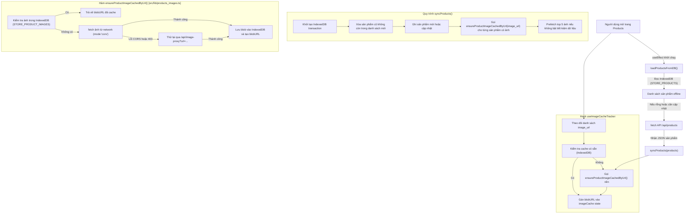

```mermaid
flowchart TD
A0["Người dùng mở trang Products"] -->|useEffect khởi chạy| A1["loadProductsFromDB()"]
A1 -->|"Đọc IndexedDB (STORE_PRODUCTS)"| A2["Danh sách sản phẩm offline"]
A2 -->|"Nếu rỗng hoặc cần cập nhật"| A3["fetch API /api/products"]
A3 -->|"Nhận JSON sản phẩm"| A4["syncProducts(products)"]

    subgraph "Quy trình syncProducts()"
      A4a["Khởi tạo IndexedDB transaction"] --> A4b["Xóa sản phẩm cũ không còn trong danh sách mới"]
      A4b --> A4c["Ghi sản phẩm mới hoặc cập nhật"]
      A4c --> A4d["Gọi ensureProductImageCachedByUrl(image_url) cho từng sản phẩm có ảnh"]
      A4d --> A4e["Prefetch top 5 ảnh nếu không bật tiết kiệm dữ liệu"]
    end

    subgraph "Hàm ensureProductImageCachedByUrl() [src/lib/products_images.ts]"
      B1["Kiểm tra ảnh trong IndexedDB (STORE_PRODUCT_IMAGES)"] -->|"Có"| B2["Trả về blobURL đã cache"]
      B1 -->|"Không có"| B3["fetch ảnh từ network (mode:'cors')"]
      B3 -->|"Lỗi CORS hoặc 403"| B4["Thử lại qua /api/image-proxy?url=..."]
      B3 -->|"Thành công"| B5["Lưu blob vào IndexedDB và tạo blobURL"]
      B4 -->|"Thành công"| B5
    end

    subgraph "Hook useImageCacheTracker"
      C1["Theo dõi danh sách image_url"] --> C2["Kiểm tra cache có sẵn (IndexedDB)"]
      C2 -->|"Có"| C3["Gán blobURL vào imageCache state"]
      C2 -->|"Không"| C4["Gọi ensureProductImageCachedByUrl() nền"]
      C4 --> C3
    end

    A0 --> C1
    A4 --> C4
```
