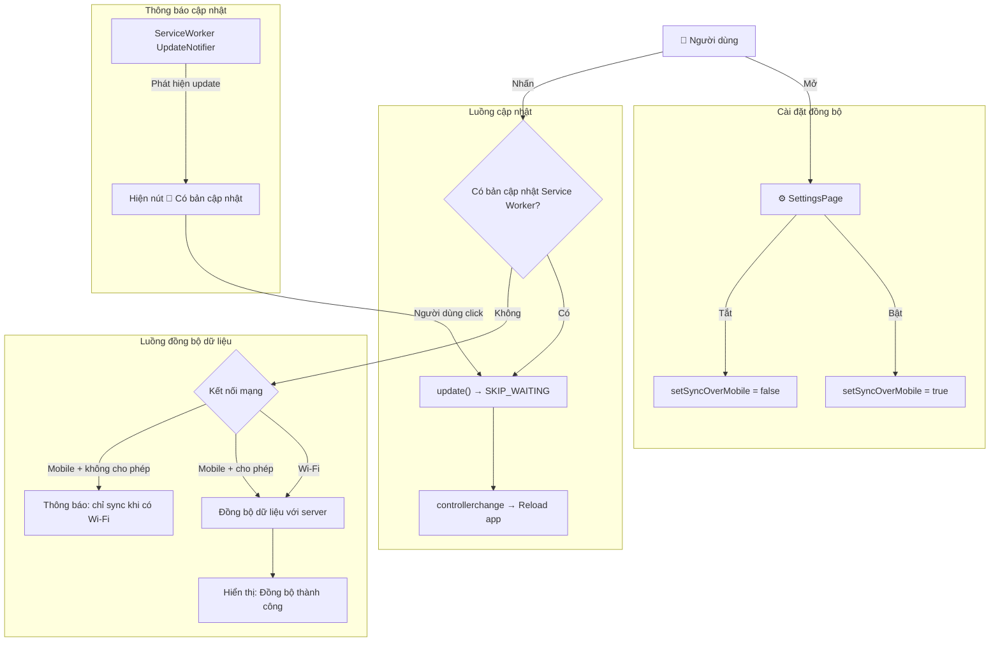

# Quy trình đồng bộ & cập nhật trong PWA (thu gọn nhánh)

```mermaid
flowchart TD
    A["👤 Người dùng"] -->|Mở| B["⚙ SettingsPage"]

    subgraph Settings["Cài đặt đồng bộ"]
      B -->|Bật| C["setSyncOverMobile = true"]
      B -->|Tắt| D["setSyncOverMobile = false"]
    end

    A -->|Nhấn| E{"Có bản cập nhật Service Worker?"}

    subgraph UpdateFlow["Luồng cập nhật"]
      E -->|Có| F["update() → SKIP_WAITING"]
      F --> G["controllerchange → Reload app"]
    end

    subgraph SyncFlow["Luồng đồng bộ dữ liệu"]
      E -->|Không| H{"Kết nối mạng"}
      H -->|Wi-Fi| I["Đồng bộ dữ liệu với server"]
      H -->|Mobile + cho phép| I
      H -->|Mobile + không cho phép| J["Thông báo: chỉ sync khi có Wi-Fi"]
      I --> K["Hiển thị: Đồng bộ thành công"]
    end

    subgraph Notifier["Thông báo cập nhật"]
      SW["ServiceWorker UpdateNotifier"] -->|Phát hiện update| L["Hiện nút 🔄 Có bản cập nhật"]
      L -->|Người dùng click| F
    end
```
